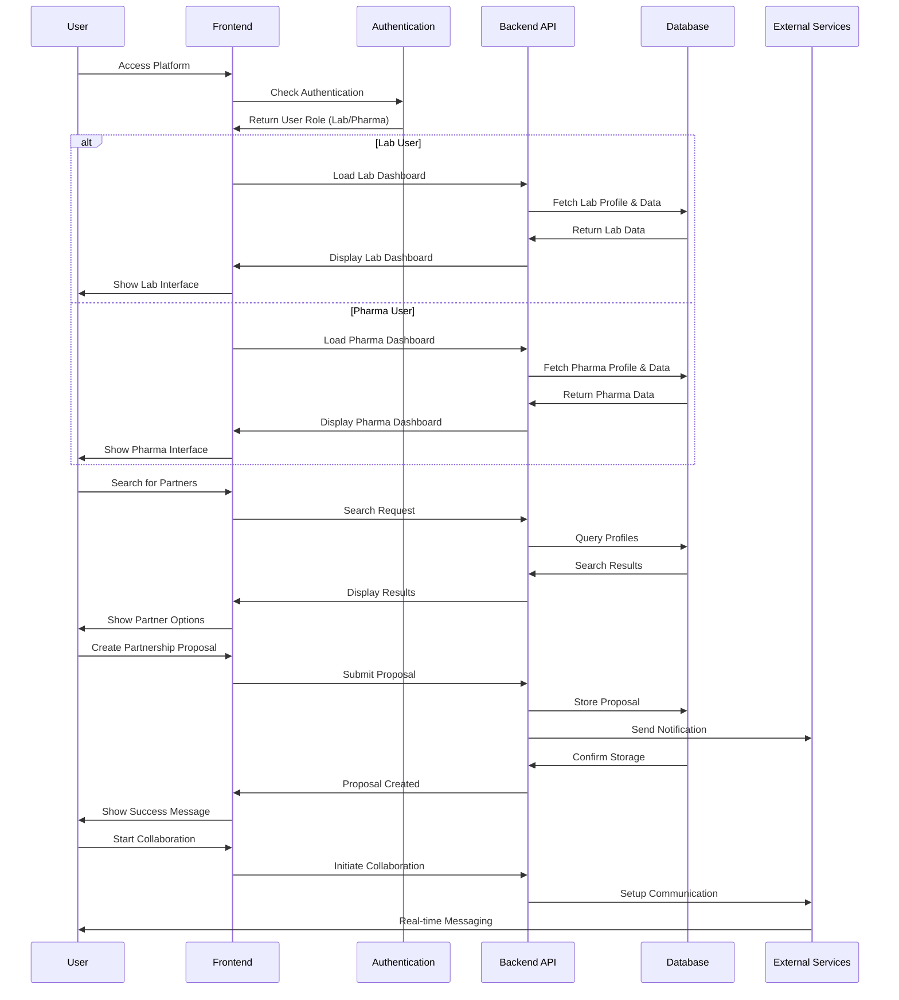

# 🧪 Lab-Pharmaceutical Collaboration Platform

A modern React/TypeScript platform designed to facilitate partnerships between research laboratories and pharmaceutical companies. Built with the latest web technologies and following the Agentic Workflow Protocol (AWP) for scalable AI-human collaboration.

[](https://reactjs.org/)
[](https://www.typescriptlang.org/)
[](https://nextjs.org/)
[](https://tailwindcss.com/)
[](https://overvibing.com)

## 🎯 Project Overview

This platform enables seamless collaboration between research laboratories and pharmaceutical companies by providing:

- **Role-based user management** (Lab vs Pharmaceutical companies)
- **Profile creation and management** for both user types
- **Advanced search and discovery** functionality
- **Partnership proposal system** with workflow management
- **Real-time collaboration tools** (messaging, document sharing)
- **Project tracking and milestone management**
- **Analytics and reporting** for partnership success

## 🚀 Technology Stack

### Frontend
- **React 18+** with TypeScript
- **Next.js 14+** with App Router for SSR
- **Tailwind CSS** for styling
- **shadcn/ui** for component library
- **React Query** for state management
- **react-hook-form** with Zod validation

### Testing & Quality
- **Jest/Vitest** for unit testing
- **React Testing Library** for component testing
- **Playwright/Cypress** for E2E testing
- **Storybook** for component documentation

### Backend Integration
- **RESTful APIs** for backend communication
- **NextAuth.js/Clerk** for authentication
- **WebSocket** for real-time features
- **AWS S3/Cloudinary** for file storage

## 📋 Project Status

### ✅ Completed
- Project foundation and AWP setup
- Comprehensive project backlog (29 main tasks, 145+ subtasks)
- Development environment configuration
- Documentation structure

### 🔄 In Progress
- Phase 1: Project Foundation & Setup

### 📅 Upcoming
- Phase 2: Authentication & User Management
- Phase 3: Core Platform Features
- Phase 4: Collaboration Tools
- Phase 5: Advanced Features & Integration

## 🏗️ Project Structure

```
awp-react/
├── agentic-sldc/          # AWP documentation and project management
│   ├── AWP.md            # Agentic Workflow Protocol
│   ├── ASDLC.md          # Agentic SDLC framework
│   └── README.md         # AWP documentation
├── .vscode/              # VS Code configuration
├── README.md             # This file
└── project.md            # Auto-generated project documentation
```

## 🏛️ System Architecture

```mermaid
graph TB
    subgraph "Frontend Layer"
        UI[React 18 + TypeScript]
        Next[Next.js 14 App Router]
        Tailwind[Tailwind CSS]
        Components[shadcn/ui Components]
        Forms[react-hook-form + Zod]
        Query[React Query]
    end

    subgraph "Authentication Layer"
        Auth[NextAuth.js/Clerk]
        RBAC[Role-Based Access Control]
        JWT[JWT Token Management]
        Security[Security Headers & CSRF]
    end

    subgraph "API Layer"
        REST[RESTful APIs]
        WebSocket[WebSocket/Socket.io]
        RateLimit[Rate Limiting]
        Validation[API Validation]
    end

    subgraph "Business Logic Layer"
        LabProfiles[Lab Profile Management]
        PharmaProfiles[Pharma Company Profiles]
        Search[Search & Discovery]
        Proposals[Partnership Proposals]
        Collaboration[Collaboration Tools]
        Analytics[Analytics & Reporting]
    end

    subgraph "Data Layer"
        Database[(Database)]
        Cache[(Redis Cache)]
        Storage[AWS S3/Cloudinary]
        SearchEngine[Elasticsearch/Algolia]
    end

    subgraph "External Integrations"
        Email[Email Service]
        Push[Push Notifications]
        Video[Video Conferencing]
        CRM[CRM Integration]
        ERP[ERP Integration]
    end

    subgraph "Testing & Quality"
        Unit[Unit Tests - Jest/Vitest]
        Integration[Integration Tests]
        E2E[E2E Tests - Playwright]
        Performance[Performance Tests]
        Security[Security Tests]
    end

    UI --> Next
    Next --> Auth
    Auth --> RBAC
    RBAC --> JWT
    JWT --> Security
    
    UI --> REST
    UI --> WebSocket
    REST --> RateLimit
    REST --> Validation
    
    REST --> LabProfiles
    REST --> PharmaProfiles
    REST --> Search
    REST --> Proposals
    REST --> Collaboration
    REST --> Analytics
    
    LabProfiles --> Database
    PharmaProfiles --> Database
    Search --> SearchEngine
    Collaboration --> Storage
    Analytics --> Cache
    
    REST --> Email
    REST --> Push
    REST --> Video
    REST --> CRM
    REST --> ERP
    
    UI --> Unit
    REST --> Integration
    UI --> E2E
    Search --> Performance
    Auth --> Security
```



## 🔄 User Flow Architecture



## 🎯 Development Phases

### 📊 Timeline Comparison: Classic vs AWP Development

| Development Approach | Estimated Timeline | Key Benefits |
|---------------------|-------------------|--------------|
| **Classic Development** | 25-33 weeks (6-8 months) | Traditional approach with manual coordination |
| **AWP Development** | 15-20 weeks (4-5 months) | AI-human collaboration, automated testing, faster iteration |

**🎯 AWP Advantages:**
- **40% faster development** through AI-human collaboration
- **Automated testing** reduces manual QA time
- **Continuous documentation** keeps everyone aligned
- **Quality gates** prevent rework and bugs
- **Structured workflow** eliminates coordination overhead

*Note: Final comparison will be measured at project completion*

---

### Phase 1: Project Foundation & Setup
- [x] AWP protocol and project structure
- [ ] Initialize React TypeScript project with Next.js
- [ ] Set up Tailwind CSS and shadcn/ui component library
- [ ] Configure project structure and folder organization
- [ ] Set up development environment and tooling
- [ ] Create basic project documentation and README
- [ ] Verify app startup and basic functionality

### Phase 2: Authentication & User Management
- [ ] Design user authentication system (login/register)
- [ ] Implement role-based access control (Lab vs Pharmaceutical)
- [ ] Create user profile management components
- [ ] Set up user session management and security
- [ ] Implement password reset and account verification
- [ ] Manual testing of authentication system

### Phase 3: Core Platform Features
- [ ] Design and implement dashboard for both user types
- [ ] Create lab profile creation and management system
- [ ] Build pharmaceutical company profile system
- [ ] Implement search and discovery functionality
- [ ] Create partnership proposal and request system
- [ ] Manual testing of core platform features

### Phase 4: Collaboration Tools
- [ ] Build messaging and communication system
- [ ] Create document sharing and management
- [ ] Implement project tracking and milestone management
- [ ] Design collaboration workspace interface
- [ ] Add notification and alert system
- [ ] Manual testing of collaboration tools

### Phase 5: Advanced Features & Integration
- [ ] Implement advanced search and filtering
- [ ] Create analytics and reporting dashboard
- [ ] Build API integration for external systems
- [ ] Implement data export and import functionality
- [ ] Add mobile responsiveness and PWA features
- [ ] Manual testing of advanced features and integration

## 🚀 Getting Started

### Prerequisites
- Node.js 18+ 
- npm or yarn
- Git

### Installation
```bash
# Clone the repository
git clone https://github.com/michaelwybraniec/awp-react.git
cd awp-react

# Install dependencies (when available)
npm install

# Start development server (when available)
npm run dev
```

### Development Workflow
1. Follow the AWP protocol in `agentic-sldc/AWP.md`
2. Reference task numbers in commit messages
3. Complete manual testing at the end of each phase
4. Update documentation as you progress

## 🤝 AWP Collaboration

This project follows the **Agentic Workflow Protocol (AWP)** for AI-human collaboration:

- **Clear roles and responsibilities** for both humans and AI agents
- **Structured task management** with hierarchical numbering
- **Quality gates** with manual testing verification
- **Transparent documentation** and progress tracking
- **Standardized commit messages** with task references

### Key AWP Principles
- All work guided by AWP protocol
- Human oversight and approval gates
- Transparency in all changes and decisions
- Continuous documentation and alignment

## 📊 Project Metrics

- **Total Tasks**: 29 main tasks
- **Total Subtasks**: 145+ detailed implementation tasks
- **Testing Coverage**: Unit, integration, E2E, performance, and security tests
- **Quality Gates**: Manual testing verification at each phase
- **Documentation**: Comprehensive AWP and technical documentation

## 🔧 Development Standards

### Commit Convention
```
type(scope step): subject
```
Examples:
- `feat(auth 2.1): implement user authentication system`
- `docs(readme 1.5): update project documentation`
- `test(dashboard 3.1): add unit tests for dashboard components`

### Code Quality
- TypeScript for type safety
- ESLint and Prettier for code formatting
- Husky for pre-commit hooks
- Comprehensive testing at all levels

## 📚 Documentation

- **[AWP Protocol](./agentic-sldc/AWP.md)** - Complete project workflow and task management
- **[Agentic SDLC](./agentic-sldc/ASDLC.md)** - Software development lifecycle framework
- **[Project Documentation](./project.md)** - Auto-generated project overview

## 🌟 Features

### For Research Laboratories
- Create detailed lab profiles with capabilities and specializations
- Showcase equipment, certifications, and success stories
- Receive partnership proposals from pharmaceutical companies
- Collaborate on projects with real-time tools

### For Pharmaceutical Companies
- Search and discover research laboratories
- Create company profiles with requirements and criteria
- Submit partnership proposals with workflow management
- Track project progress and milestones

### Collaboration Features
- Real-time messaging and communication
- Document sharing with version control
- Project tracking with Gantt charts
- Meeting scheduling and video conferencing
- Analytics and reporting for partnership success

## 🛡️ Security & Compliance

- Role-based access control (RBAC)
- JWT token management with refresh logic
- CSRF protection and secure cookies
- Two-factor authentication (2FA)
- Audit logging for user actions
- Rate limiting and security headers

## 📱 Mobile & PWA

- Responsive design for all screen sizes
- Progressive Web App (PWA) functionality
- Offline capability for core features
- Mobile push notifications
- Touch-optimized interactions

## 🤝 Contributing

This project follows the AWP protocol for contributions. Please:

1. Read the [AWP documentation](./agentic-sldc/AWP.md)
2. Follow the task numbering system
3. Include comprehensive testing
4. Update documentation as needed
5. Use the commit standard with task references

## 📄 License

This project is part of the [OVERVIBING.COM](https://overvibing.com) community.

## 👨‍💻 Author

**Michael Wybraniec**
- [ONE-FRONT.COM](https://one-front.com)
- [OVERVIBING.COM](https://overvibing.com)

---

**Built with ❤️ using the Agentic Workflow Protocol (AWP)**