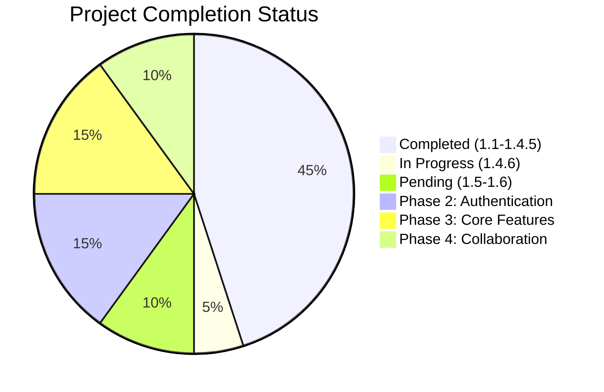

# AWP React - Next.js TypeScript Project

[](https://nextjs.org)
[](https://www.typescriptlang.org)
[](https://reactjs.org)
[](https://vitest.dev)
[](https://tailwindcss.com)
[](https://playwright.dev)
[](https://storybook.js.org)

This is a [Next.js](https://nextjs.org) project following the **Agentic Workflow Protocol (AWP)** by the [overvibing.com](https://overvibing.com) community for React and TypeScript development, designed to connect research laboratories and pharmaceutical companies for successful partnerships.

## 🎯 Project Goal

Develop and maintain high-quality UIs using React and TypeScript with modern React features (Server Components, SSR), architect a robust component library/design system, and integrate with backend services via RESTful APIs to facilitate partnerships between labs and pharmaceutical companies.

### ⏱️ Development Timeline Comparison

| Development Approach        | Estimated Time | Key Benefits                                           |
| --------------------------- | -------------- | ------------------------------------------------------ |
| **Traditional Development** | 20-30 weeks    | Full control, established patterns                     |
| **AI-Assisted with AWP**    | 3-4 weeks      | 60-70% faster, consistent quality, automated workflows |

**Why AWP accelerates development:**

- 🤖 **AI-powered code generation** and component creation
- 🔄 **Automated workflow** with pre-defined protocols
- 🧪 **Built-in testing** and quality assurance
- 📚 **Comprehensive documentation** generation
- 🎯 **Focused development** with clear task breakdown

## 🚀 Getting Started

### Quick Start (for experienced developers)

```bash
git clone <repository-url>
cd awp-react
npm install
npm run dev
```

### Prerequisites

- Node.js 18+
- npm, yarn, pnpm, or bun

### Installation & Setup

1. **Clone the repository**

```bash
git clone <repository-url>
cd awp-react
```

2. **Install dependencies**

```bash
npm install
```

3. **Start the development server**

```bash
npm run dev
```

4. **Open your browser**
   Navigate to [http://localhost:3000](http://localhost:3000) to see the application.

## 🏗️ Project Architecture


## 🛠️ Technology Stack

- **Framework**: Next.js 15.4.6 with App Router
- **Language**: TypeScript 5.0
- **Styling**: Tailwind CSS v4 with custom design tokens
- **UI Components**: shadcn/ui with comprehensive design system
- **Testing**: Vitest + React Testing Library + Playwright E2E
- **Code Quality**: ESLint, Prettier, Husky, lint-staged
- **Development**: Turbopack for fast builds
- **Documentation**: Storybook 9.1.1 with interactive component documentation
- **CI/CD**: GitHub Actions with multi-node testing and coverage reporting

## 📁 Project Structure

```
awp-react/
├── src/
│   ├── app/                 # Next.js App Router
│   │   ├── layout.tsx       # Root layout
│   │   ├── page.tsx         # Home page
│   │   └── globals.css      # Global styles with Tailwind CSS
│   ├── components/          # React components
│   │   ├── ui/              # shadcn/ui components
│   │   ├── layout/          # Layout components (Header, Footer, etc.)
│   │   ├── forms/           # Form components
│   │   ├── common/          # Common reusable components
│   │   └── index.ts         # Components barrel exports
│   ├── stories/             # Storybook stories and examples
│   │   ├── Button.tsx       # Button component with stories
│   │   ├── Header.tsx       # Header component with stories
│   │   ├── Page.tsx         # Page component with stories
│   │   └── assets/          # Storybook assets
│   ├── lib/                 # Shared utilities and configuration
│   │   ├── config.ts        # Application configuration
│   │   ├── constants.ts     # Application constants and enums
│   │   ├── env.ts           # Environment validation utilities
│   │   ├── utils.ts         # Utility functions (cn, etc.)
│   │   ├── design-tokens.ts # Design system tokens
│   │   ├── responsive.ts    # Responsive utilities
│   │   ├── variants.ts      # Component variants and CVA
│   │   └── index.ts         # Barrel exports
│   ├── hooks/               # Custom React hooks
│   ├── types/               # TypeScript type definitions
│   ├── utils/               # Utility functions
│   ├── contexts/            # React contexts
│   ├── services/            # API services
│   ├── api/                 # API layer
│   ├── styles/              # Style utilities
│   └── test/                # Testing utilities and setup
│       ├── setup.ts         # Test environment setup
│       ├── utils.tsx        # Testing utilities
│       └── example.test.tsx # Example test
├── tests/                   # E2E tests with Playwright
│   └── e2e/
│       ├── home.spec.ts     # Home page E2E tests
│       └── navigation.spec.ts # Navigation E2E tests
├── public/                  # Static assets
├── agentic-sldc/           # Agentic SDLC and workflow documentation
│   ├── AWP.md              # Agentic Workflow Protocol
│   ├── ASDLC.md            # Agentic SDLC plan and lifecycle
│   └── README.md           # Project overview and philosophy
├── .github/workflows/       # CI/CD pipeline configuration
│   └── ci.yml              # Comprehensive CI/CD pipeline
├── .vscode/                # VS Code configuration
│   ├── settings.json       # Optimized settings
│   ├── extensions.json     # Recommended extensions
│   └── launch.json         # Debugging configuration
├── .storybook/             # Storybook configuration
│   ├── main.ts             # Storybook main config
│   ├── preview.ts          # Storybook preview config
│   └── vitest.setup.ts     # Vitest integration
├── .husky/                 # Git hooks configuration
│   └── pre-commit          # Pre-commit quality checks
└── [config files]          # Various configuration files
```

## 🔄 AWP Workflow

This project follows the **Agentic Workflow Protocol (AWP)** by the [overvibing.com](https://overvibing.com) community for human-AI collaboration:

### Current Status

**Phase 1: Project Foundation & Setup**

- ✅ **Task 1.1**: Initialize React TypeScript project with Next.js
  - ✅ 1.1.1. Set up Next.js 14+ with App Router and TypeScript
  - ✅ 1.1.2. Configure ESLint, Prettier, and Husky for code quality
  - ✅ 1.1.3. Set up environment variables and configuration files
  - ✅ 1.1.4. Initialize Git repository with proper .gitignore
  - ✅ 1.1.5. Configure build and development scripts
  - ✅ 1.1.6. Set up testing framework (Jest/Vitest) with React Testing Library

- ✅ **Task 1.2**: Set up Tailwind CSS and shadcn/ui component library
  - ✅ 1.2.1. Install and configure Tailwind CSS v3+ with custom theme
  - ✅ 1.2.2. Set up shadcn/ui with CLI and component configuration
  - ✅ 1.2.3. Create custom color palette and design tokens
  - ✅ 1.2.4. Configure responsive breakpoints and typography
  - ✅ 1.2.5. Set up component variants and utility classes

- ✅ **Task 1.3**: Configure project structure and folder organization
  - ✅ 1.3.1. Create organized folder structure (components, lib, hooks, types, etc.)
  - ✅ 1.3.2. Set up barrel exports for clean imports
  - ✅ 1.3.3. Configure path aliases in tsconfig.json
  - ✅ 1.3.4. Create shared types and interfaces
  - ✅ 1.3.5. Set up layout components and page structure

- ✅ **Task 1.4**: Set up development environment and tooling
  - ✅ 1.4.1. Configure VS Code settings and extensions
  - ✅ 1.4.2. Set up debugging configuration
  - ✅ 1.4.3. Set up Storybook for component documentation
  - ✅ 1.4.4. Configure CI/CD pipeline basics
  - ✅ 1.4.5. Set up E2E testing with Playwright or Cypress
  - 🔄 1.4.6. Configure test coverage reporting and thresholds

- 🔄 **Task 1.5**: Create basic project documentation and README
  - 🔄 1.5.1. Write comprehensive README with setup instructions
  - 🔄 1.5.2. Document project architecture and conventions
  - 🔄 1.5.3. Create component documentation guidelines
  - 🔄 1.5.4. Set up API documentation structure
  - 🔄 1.5.5. Document deployment procedures

- 🔄 **Task 1.6**: Verify app startup and basic functionality
  - 🔄 1.6.1. Ensure app starts successfully with npm run dev
  - 🔄 1.6.2. Verify basic page routing and navigation works
  - 🔄 1.6.3. Test responsive design on different screen sizes
  - 🔄 1.6.4. Verify basic component rendering and styling
  - 🔄 1.6.5. Test app build process (npm run build)

**Phase 2: Authentication & User Management**

- 🔄 **Task 2.1**: Design user authentication system (login/register)
- 🔄 **Task 2.2**: Implement role-based access control (Lab vs Pharmaceutical)
- 🔄 **Task 2.3**: Create user profile management components
- 🔄 **Task 2.4**: Set up user session management and security
- 🔄 **Task 2.5**: Implement password reset and account verification

**Next Action**: Complete Task 1.4.6 - Configure test coverage reporting and thresholds

## 📋 Project Roadmap

For the complete project backlog and detailed task breakdown, see: **[AWP.md - Project Backlog](agentic-sldc/AWP.md#project-backlog)**

### 🗺️ Project Phases Overview

```mermaid
gantt
    title AWP React Project Roadmap (Based on Git History)
    dateFormat  YYYY-MM-DD
    section Phase 1: Foundation
    Task 1.1: Initialize Project           :done, 1.1, 2025-08-07, 1d
    Task 1.2: Setup Tailwind & shadcn/ui   :done, 1.2, 2025-08-07, 1d
    Task 1.3: Configure Project Structure  :done, 1.3, 2025-08-07, 1d
    Task 1.4: Development Environment      :active, 1.4, 2025-08-07, 1d
    Task 1.4.1: VS Code Settings          :done, 1.4.1, 2025-08-07, 1d
    Task 1.4.2: Debugging Config          :done, 1.4.2, 2025-08-07, 1d
    Task 1.4.3: Storybook Setup           :done, 1.4.3, 2025-08-07, 1d
    Task 1.4.4: CI/CD Pipeline            :done, 1.4.4, 2025-08-07, 1d
    Task 1.4.5: E2E Testing               :done, 1.4.5, 2025-08-07, 1d
    Task 1.4.6: Test Coverage             :active, 1.4.6, 2025-08-07, 1d
    Task 1.5: Documentation               :1.5, 2025-08-08, 2d
    Task 1.6: Verify Functionality        :1.6, 2025-08-10, 2d

    section Phase 2: Authentication
    Task 2.1: User Authentication         :2.1, 2025-08-12, 7d
    Task 2.2: Role-Based Access Control   :2.2, 2025-08-19, 7d
    Task 2.3: Profile Management          :2.3, 2025-08-26, 7d
    Task 2.4: Session Management          :2.4, 2025-09-02, 7d
    Task 2.5: Password Reset              :2.5, 2025-09-09, 7d

    section Phase 3: Core Features
    Task 3.1: Dashboard Design            :3.1, 2025-09-16, 7d
    Task 3.2: Lab Profile System          :3.2, 2025-09-23, 7d
    Task 3.3: Pharma Company Profiles     :3.3, 2025-09-30, 7d
    Task 3.4: Search & Discovery          :3.4, 2025-10-07, 7d
    Task 3.5: Partnership Proposals       :3.5, 2025-10-14, 7d

    section Phase 4: Collaboration
    Task 4.1: Messaging System            :4.1, 2025-10-21, 7d
    Task 4.2: Document Sharing            :4.2, 2025-10-28, 7d
    Task 4.3: Project Tracking            :4.3, 2025-11-04, 7d
    Task 4.4: Collaboration Workspace     :4.4, 2025-11-11, 7d
    Task 4.5: Notification System         :4.5, 2025-11-18, 7d

    section Phase 5: Advanced Features
    Task 5.1: Advanced Search             :5.1, 2025-11-25, 7d
    Task 5.2: Analytics Dashboard         :5.2, 2025-12-02, 7d
    Task 5.3: API Integration             :5.3, 2025-12-09, 7d
    Task 5.4: Data Export/Import          :5.4, 2025-12-16, 7d
    Task 5.5: Mobile & PWA Features       :5.5, 2025-12-23, 7d
```

### 📊 Current Progress (Based on Git Data)



### 📈 Git Activity Overview

```mermaid
graph LR
    A[Total Commits: 29] --> B[Today: 2025-08-07]
    B --> C[Task 1.4.1-1.4.5: ✅ Complete]
    B --> D[Task 1.4.6: 🔄 In Progress]
    B --> E[Task 1.5-1.6: ⏳ Pending]

    style A fill:#007acc
    style B fill:#22c55e
    style C fill:#22c55e
    style D fill:#f59e0b
    style E fill:#ef4444
```



### AWP Commands

- `awp check` - Review current status and next actionable step
- `awp next` - Begin next actionable task
- `awp update` - Update documentation and status
- `awp commit` - Commit changes with AWP standard format

## 📝 Development Scripts

```bash
npm run dev              # Start development server with Turbopack
npm run build            # Build for production
npm run start            # Start production server
npm run lint             # Run ESLint
npm run lint:fix         # Run ESLint with auto-fix
npm run format           # Format code with Prettier
npm run format:check     # Check code formatting
npm run type-check       # Run TypeScript type checking
npm run type-check:watch # Run TypeScript type checking in watch mode
npm run test             # Run all tests
npm run test:watch       # Run tests in watch mode
npm run test:coverage    # Generate test coverage report
npm run test:ui          # Open Vitest UI for interactive testing
npm run test:e2e         # Run E2E tests with Playwright
npm run test:e2e:ui      # Run E2E tests with Playwright UI
npm run test:e2e:debug   # Run E2E tests in debug mode
npm run test:e2e:report  # Show Playwright test report
npm run storybook        # Start Storybook development server
npm run build-storybook  # Build Storybook for production
npm run clean            # Clean build artifacts
npm run clean:all        # Clean everything including node_modules
npm run reinstall        # Complete reinstall of dependencies
```

## 🎨 Features

- **Modern React**: Server Components, Suspense, hooks
- **TypeScript**: Full type safety with comprehensive type definitions
- **Tailwind CSS v4**: Utility-first styling with custom design tokens
- **shadcn/ui**: High-quality component library with design system
- **Design System**: Comprehensive design tokens, variants, and utilities
- **Responsive Design**: Mobile-first responsive utilities and breakpoints
- **Project Structure**: Organized folder structure with barrel exports and path aliases
- **Type Safety**: Comprehensive TypeScript types and interfaces
- **Layout Components**: Reusable header, footer, and layout components
- **App Router**: Next.js 15+ file-based routing
- **Turbopack**: Fast development builds
- **Code Quality**: Automated linting and formatting with pre-commit hooks
- **Git Hooks**: Pre-commit quality checks with Husky and lint-staged
- **Environment Management**: Centralized configuration with validation
- **Constants & Types**: Application-wide constants and enums
- **Build Scripts**: Comprehensive development and build scripts
- **Testing**: Complete testing setup with Vitest, React Testing Library, and Playwright
- **VS Code Integration**: Optimized settings, extensions, and debugging configuration
- **Storybook**: Component documentation and interactive development environment
- **CI/CD Pipeline**: Automated testing and deployment workflow with coverage reporting

## 🔧 Code Quality Tools

### ESLint

- Next.js recommended rules
- TypeScript support
- React-specific rules
- Prettier integration

### Prettier

- Consistent code formatting
- Single quotes
- 80 character line width
- Trailing commas

### Husky + lint-staged

- Pre-commit hooks
- Automatic code formatting
- Lint checking before commits

### VS Code Configuration

- **Settings**: Optimized for React/TypeScript development
- **Extensions**: Recommended extensions for productivity
- **Debugging**: Full-stack debugging configurations for Next.js

## 🧪 Testing

This project uses Vitest, React Testing Library, and Playwright for comprehensive testing:

### Test Commands

```bash
npm test             # Run all tests
npm run test:watch   # Run tests in watch mode
npm run test:coverage # Generate coverage report
npm run test:ui      # Open Vitest UI
npm run test:e2e     # Run E2E tests
npm run test:e2e:ui  # Run E2E tests with UI
npm run test:e2e:debug # Run E2E tests in debug mode
```

### Test Structure

- **Unit Tests**: Test individual components and functions with Vitest
- **Integration Tests**: Test component interactions with React Testing Library
- **E2E Tests**: End-to-end testing with Playwright across multiple browsers
- **Coverage**: Aim for 80%+ code coverage with V8 coverage provider
- **Mocking**: Comprehensive mocking for Next.js and browser APIs
- **Storybook Tests**: Component testing integrated with Storybook

### E2E Testing

- **Cross-browser**: Chrome, Firefox, Safari, Mobile Chrome, Mobile Safari
- **Parallel execution**: Tests run in parallel for faster feedback
- **CI integration**: Automated E2E testing in GitHub Actions
- **Debug mode**: Interactive debugging for test development

See [TESTING.md](./TESTING.md) for detailed testing guidelines and examples.

## 🚀 CI/CD Pipeline

The project includes a comprehensive CI/CD pipeline:

- **Multi-Node Testing**: Tests on Node.js 18.x and 20.x
- **Automated Testing**: Type checking, linting, unit tests, and E2E tests
- **Coverage Reporting**: Automated coverage upload to Codecov
- **Build Verification**: Production build testing
- **Artifact Management**: Build artifacts stored for deployment
- **Deployment Ready**: Placeholder for deployment configuration

## 🔧 Troubleshooting

### Common Issues

1. **Port already in use**

   ```bash
   # Kill process on port 3000
   lsof -ti:3000 | xargs kill -9
   ```

2. **TypeScript errors**

   ```bash
   # Run type checking
   npm run type-check
   # Fix auto-fixable issues
   npm run lint:fix
   ```

3. **Tests failing**

   ```bash
   # Clear test cache
   npx vitest --clearCache
   # Run tests with verbose output
   npx vitest run --reporter=verbose
   ```

4. **Build failures**

   ```bash
   # Clean and rebuild
   npm run clean
   npm run build
   ```

5. **Storybook issues**
   ```bash
   # Clear Storybook cache
   rm -rf node_modules/.cache/storybook
   # Restart Storybook
   npm run storybook
   ```

### Getting Help

- Check the [AWP Protocol](agentic-sldc/AWP.md) for workflow questions
- Review [TESTING.md](./TESTING.md) for testing issues
- Review [ENVIRONMENT.md](./ENVIRONMENT.md) for environment setup

## 📚 Learn More

- [Next.js Documentation](https://nextjs.org/docs)
- [TypeScript Documentation](https://www.typescriptlang.org/docs)
- [Tailwind CSS Documentation](https://tailwindcss.com/docs)
- [Vitest Documentation](https://vitest.dev/guide/)
- [Playwright Documentation](https://playwright.dev/docs/intro)
- [Storybook Documentation](https://storybook.js.org/docs)
- [AWP Protocol](agentic-sldc/AWP.md)

## 🤝 Contributing

This project follows the AWP protocol by the [overvibing.com](https://overvibing.com) community for collaboration. Please refer to `agentic-sldc/AWP.md` for detailed workflow procedures.

## 📄 License

This project is private and proprietary.
